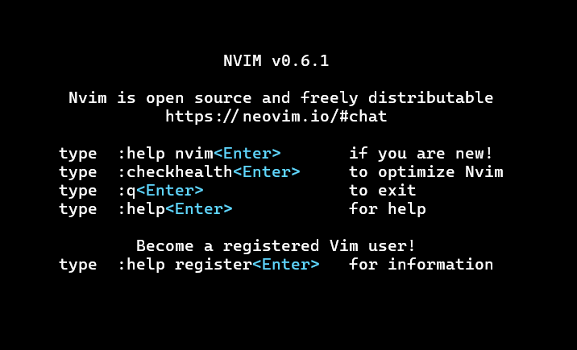
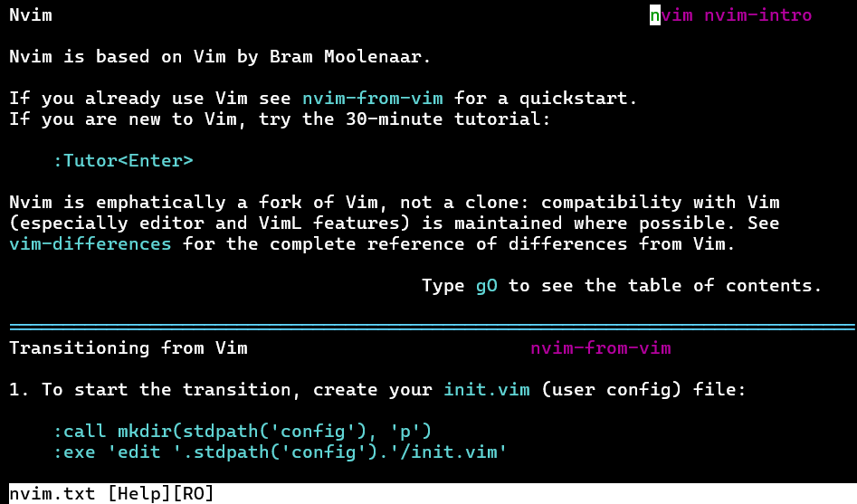

# Sidestepping the Roadblock...

&emsp; While attempting to work through Git BASH yesterday to get this site set up, I got Trapped in Vim&trade;, which is apparently a very normal experience for beginners:

<div style = "float:left; position:relative; width: 38.2%; right: 10px; top: 0px;">

</div>

&emsp; After trying what felt like everything that made sense and caving in to my impatience in the moment, I closed the window and learned how to change the default editor in Git Bash and [set it to nano](https://stackoverflow.com/questions/13257519/how-to-change-the-default-editor-for-git):

```
git config --global core.editor "nano"
```

That way I would be able to type my commit messages and progress. Moments later I learned you can bypass the need for an editor in this step [with the -m option](https://git-scm.com/book/en/v2/Git-Basics-Recording-Changes-to-the-Repository), rendering this change unnecessary:

```
git commit -m "my message for this commit"
```

&emsp; But that left me feeling like there was a missed opportunity to learn a potentially valuable tool. I'd heard that Vim was a "love-it-or-hate-it" editor that could be incredibly powerful, but only after a lot of headache. The more I sat with it, the more that sounded like exactly the type of challenge I crave.

# ... Only to Go Back

&emsp; I've decided to work with Neovim because it sounds like it's Vim but with some added features and quality of life updates. To get Neovim installed on the WSL (Windows Subsystem for Linux), I ran an update, then installed Neovim:

```
wsl sudo apt update 

wsl sudo apt install neovim

wsl neovim
```

<div style = "float:right; position:relative; width: 38.2%; right: 10px; top: 0px;">

&emsp; The Neovim intro page.
</div>

&emsp; After being greeted by the intro page, which I've learned you can open at any time with ":intro<Enter>", I saw that there's a section right at the top for beginners. PERFECT. For some reason my gut reaction to seeing ":" is that it's indicative of a command but does not require any particular action by the user. For Vim though, you actually need to type ":" in order to make those commands happen. Before committing to a tutorial I checked out the help page:

<div style = "float:left; position:relative; width: 38.2%; right: 10px; top: 0px;">

</div>

&emsp; It's going to take some time to adjust to learning to move the cursor with the h, j, k, and l keys. But the real gold of this page is learning how to exit the page ":q" or exit vim entirely ":qa!". I'll never be trapped again.

<div style = "float:right; position:relative; width: 38.2%; right: 10px; top: 0px;">

</div>

&emsp; I wasn't a Vim user, but I am now, so I didn't require any of the functions to transfer from Vim to Neovim. But I spotted an option for a Tutorial for those new to Vim which could be accessed with ":Tutor<Enter>". The core contents of that tutorial will be the subject of my next post about Neovim. 


